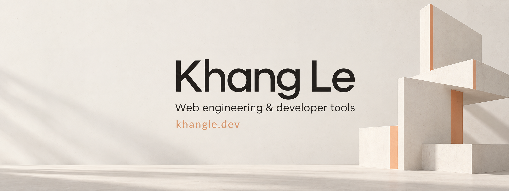

I'm a senior frontend engineer at **Navigos Group Vietnam**, based in Ho Chi Minh City. I've been building web products since 2018.

At Navigos, I'm part of the core frontend team supporting **Navigos Talent One and VietnamWorks across squads**. My work includes frontend architecture, the NTO landing-page builder, and employer recruitment workflows. I review code, support a junior frontend teammate, and collaborate with backend engineers, product, design, and QA. Earlier work includes PRIMUS and internal recruitment tools.

My latest side project is the [UWANT Vietnam website](https://uwant.khangle.dev), built with WordPress, with product pages, a responsive showroom, and contact workflows.

### Tools I build

- [React utilities](https://github.com/khanglvm/react) cover shared state, typed translations, browser events, and component helpers. `createContextState` combines selector hooks with reversible Immer updates for optimistic UI.
- [Relay](https://github.com/khanglvm/relay) gives coding agents a browser board for review. Comments stay attached to visual elements or image areas and return to the agent with your decisions. [npm](https://www.npmjs.com/package/@khanglvm/relay)
- [figma-lens CLI](https://github.com/khanglvm/figma-lens) pairs focused design inspection with an agent skill for checking details and verifying the finished UI. It is my independent tool, not affiliated with Figma. [npm](https://www.npmjs.com/package/figma-lens)
- [Jira CLI](https://github.com/khanglvm/jira-cli) gives people and agents short commands for legacy Jira Server, with dry runs before changes are sent. [npm](https://www.npmjs.com/package/@khanglvm/jira-cli)
- [Outline CLI](https://github.com/khanglvm/outline-cli) finds wiki pages by title or URL, returns focused summaries, and checks revisions before applying patches. [npm](https://www.npmjs.com/package/@khanglvm/outline-cli)

Most of my work uses TypeScript, React, Next.js, Angular, and Node.js. I care about clear module boundaries and the details that make interfaces feel right.

[Portfolio & CV](https://khangle.dev) · [LinkedIn](https://www.linkedin.com/in/le-vu-minh-khang/) · [npm packages](https://www.npmjs.com/~levuminhkhang)
